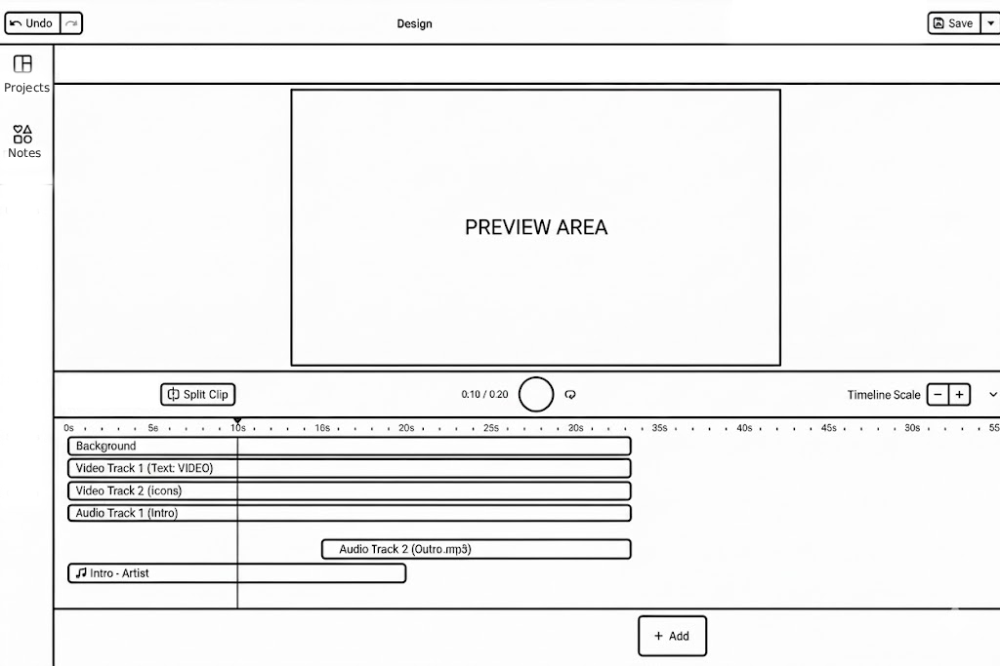

# Zadanie rekrutacyjne – Frontend Engineer (React)

## Cel zadania

Celem zadania **nie jest stworzenie kompletnego edytora wideo**, lecz pokazanie:

- jak projektujesz architekturę frontendu,
- jak iterujesz nad kodem (również z użyciem AI).

Możesz (i wręcz powinieneś) korzystać z narzędzi AI.  
Interesuje nas **proces**, a nie tylko efekt końcowy.

---

## Stack (wymagany)

- **React 18+**
- **Redux / Zustand / React `useContext` / `useState`**  
  Decyzja dotycząca zarządzania stanem należy do Ciebie.
- **TailwindCSS v3+**
- Jeden zestaw komponentów bazowych:
  - shadcn/ui **lub**
  - Material UI **lub**
  - Ant Design  
  - lub inna biblioteka komponentów
- **Ramda (preferowane)** lub Lodash
- Asynchroniczność:
  - Promisy / `async–await`
  - _Fluture.js lub Effect.js_ (jeśli znasz)
- **ECMAScript (bez TypeScriptu)**

---

## Opis aplikacji

Zbuduj **uproszczony edytor wideo** działający wyłącznie po stronie frontendu.

Aplikacja **nie operuje na prawdziwym wideo** — podgląd wideo jest placeholderem (np. statycznym obrazem).  
Główna funkcjonalność skupia się na **timeline** i interakcji użytkownika.

---

## Podgląd wideo (placeholder)

- Statyczny obraz pełniący rolę „playera”
- Dynamiczny napis informujący:
  - który klip jest aktualnie aktywny
  - lub jaki zakres timeline’u jest zaznaczony

  

---

## Timeline (kluczowa część zadania)

Timeline powinien umożliwiać:

- wyświetlanie wielu klipów na osi czasu
- poruszanie playheadem (aktualny czas)
- zaznaczanie klipów
- aktywowanie klipu
- dzielenie klipu na dwa (split)
- dodawanie nowych klipów

> Klipy są abstrakcyjnymi obiektami danych — nie zawierają prawdziwego wideo.

---

## Architektura i stan aplikacji

Sposób organizacji stanu **pozostawiamy Tobie**.  
Oczekujemy jedynie, że przepływ danych będzie sensownie zaplanowany i że będziesz w stanie tę decyzję uzasadnić.

Nie narzucamy konkretnego rozwiązania — interesują nas **Twoje decyzje architektoniczne**.

---

## API

API zostało przygotowane przez nas i jest **celowo bardzo elastyczne**.

Dla każdej encji (np. projekt, klip, notatka):
- jedynym wymaganym polem jest `id`
- cała pozostała zawartość znajduje się w polu `data`
- **kształt obiektu `data` nie jest narzucony** i powinien wynikać z Twoich decyzji projektowych

API pełni rolę **ogólnego storage’u**, a nie warstwy narzucającej model domenowy.

---

### REST API – Projekty

REST API służy do przechowywania projektów edytora.

Wymagane operacje:

- `GET` – pobieranie projektów
- `POST` – tworzenie projektu
- `PUT` – aktualizacja projektu
- `DELETE` – usuwanie projektu

Projekt może zawierać m.in.:

- metadane
- dane timeline’u (np. klipy)

API będzie dostępne w forkowanym repozytorium wraz z instrukcją uruchomienia.

---

### GraphQL API – Notatki

GraphQL API służy do obsługi **notatek przypisanych do projektu**.

Wymagane:

- przynajmniej jedno `query`
- przynajmniej jedna `mutation`
- integracja z UI (np. lista notatek, dodawanie notatki)

API będzie dostępne w forkowanym repozytorium wraz z instrukcją uruchomienia.

---

## Proces pracy (bardzo ważne)

1. Sforkuj repozytorium, które dostarczymy, i utwórz **publiczne repozytorium na GitHubie**
2. Pracuj iteracyjnie:
   - **commituj co ~5–10 minut**
   - stosuj sensowne commit message’y opisujące zmiany lub problemy, z którymi aktualnie się mierzysz  
     Commituj również wtedy, gdy kod nie działa — interesuje nas proces, a nie wyłącznie gotowe rozwiązanie.
3. Możesz korzystać z AI:
   - do generowania kodu
   - do refactoru
   - do analizy problemów  

   Jeśli korzystałeś z AI, na końcu poprosimy Cię o udostępnienie zapisu rozmów w formie linków  
   (np. ChatGPT udostępnia taką funkcję również w darmowej wersji).

Nie ma znaczenia, czy aplikacja jest w 100% ukończona — **liczy się proces**.

---

## Na koniec dostarcz

- link do repozytorium GitHub
- linki do rozmów z LLM
- krótki opis w README:
  - jak podszedłeś do architektury
  - co poprawiłbyś, mając więcej czasu

---

## Rzeczy opcjonalne (*nice to have*)

- *Obsługa wielu zaznaczonych klipów*
- *Undo / redo*
- *Zoom timeline’u*
- *Użycie Fluture.js lub Effect.js*
- *Refactor kodu wygenerowanego przez AI*
- *Podstawowe testy*
- *Zaawansowane operacje na klipach (np. grupowanie)*

---

## Ważne

- Nie oceniamy designu UI
- Nie oceniamy kompletności funkcji
- Oceniana jest **jakość decyzji technicznych**, struktura kodu i sposób pracy

Powodzenia 🚀
